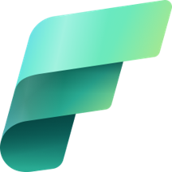

  
  <h1>MicrosoftFabric-Exploratorium</h1>
  
Your Ultimate Guide to Mastering End-to-End Analytics with Microsoft Fabric

🚀 This comprehensive educational resource is designed to help you master end-to-end analytics using Microsoft Fabric. Whether you're a beginner or an experienced data professional, you'll find a wealth of information, tutorials, and resources to enhance your skills and understanding of Microsoft Fabric's capabilities.
# MicrosoftFabric-Exploratorium

## Introduction

MicrosoftFabric-Exploratorium serves as a guide to understanding, creating, and optimizing analytical solutions using Microsoft Fabric. Whether you're a data engineer, analyst, data scientist, or business intelligence professional, this repository provides valuable insights and resources to enhance your skills and knowledge.

## Sections

- [Lakehouses and Spark](Lakehouses_and_Spark/lakehouses_and_spark.md)
  - Explore the core features and capabilities of Lakehouses in Microsoft Fabric.
  - Learn how to create and ingest data into a Lakehouse.
  - Query Lakehouse tables with SQL and transform data using Spark.

- [Data Integration and Dataflows](Data_Integration_and_Dataflows/data_integration_and_dataflows.md)
  - Learn various data integration techniques and tools, including Data Factory Pipelines and Dataflows (Gen2).
  - Dive into tutorials on data integration and transformation.

- [Data Warehousing and Real-Time Analytics](Data_Warehousing_and_RealTime_Analytics/data_warehousing_and_realtime.md)
  - Understand the fundamentals of data warehousing in Microsoft Fabric.
  - Explore real-world examples and best practices for implementing real-time analytics.

- ...

## How to Use This Repository

1. Clone the repository or download the ZIP archive.
2. Navigate to the relevant sections based on your interests.
3. Each section contains detailed information, tutorials, examples, and resources.

## Contribution

Contributions are welcome! If you'd like to add content, fix issues, or improve existing resources, please fork this repository and create a pull request.

## License 📜

This repository is licensed under the [MIT License](./LICENSE).

---

**Note:** This repository is a work in progress, and more sections and content will be added over time to cover a wide range of topics related to Microsoft Fabric. Stay tuned for updates!

We're excited to accompany you on this educational journey as you explore the world of Microsoft Fabric and elevate your analytics skills! 🎓
